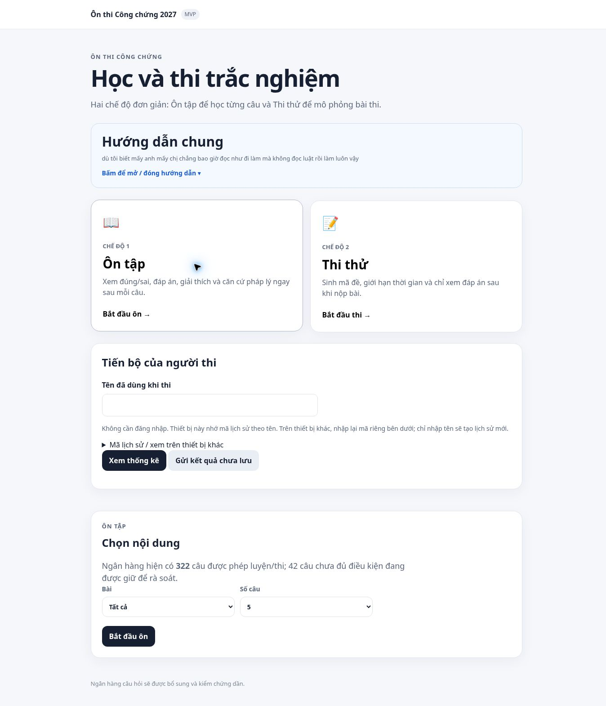

# Kiểm tra triển khai ngân hàng đặt cọc — 05/10/2026

- Bản dữ liệu và tích hợp: `7d89c0268977cf8d94c387cb0d58b726b879b801`.
- Bản cập nhật phiên bản app.js: `a84a14a61c0c599c555c692f5f4984d8a785ad78`.
- GitHub Pages workflow 37275606955 hoàn thành thành công.
- Kiểm tra trực tiếp https://hunghvt-cyber.github.io/CongchungVND/: hiển thị 322 câu được phép luyện/thi, 42 câu giữ để rà soát trong các file được app tải.
- Ôn tập: chọn đáp án, chấm đúng, hiện giải thích và liên kết căn cứ pháp lý.
- Thi thử: tạo mã đề, đồng hồ đếm ngược, chuyển câu rồi quay lại vẫn giữ lựa chọn. Thoát trước khi nộp, không ghi kết quả kiểm thử vào lịch sử trung tâm.
- `node --test tests/*.test.cjs`: 31/31 đạt; có kiểm tra riêng toàn bộ 18 câu đặt cọc qua ôn tập và chấm bài thi.
- Không thay đổi cấu trúc lưu kết quả/progress. Không công bố tài liệu DOCX gốc.

