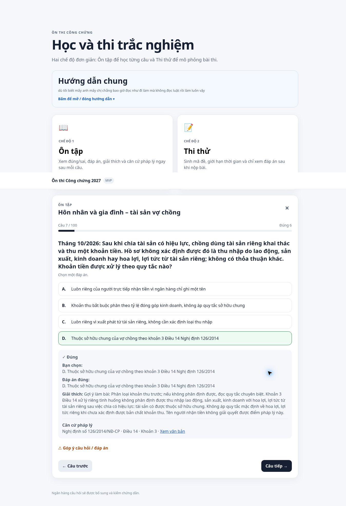

# Kiểm tra triển khai bộ hôn nhân gia đình

Ngày kiểm tra: 06/10/2026. Commit dữ liệu và tích hợp: `15fa77d18ac23bcf9c4de8f62157a17c3285c9b7`.

- GitHub Pages: build và deploy thành công, workflow [37415756790](https://github.com/hunghvt-cyber/CongchungVND/actions/runs/37415756790).
- Web thực tế hiển thị 368 câu đủ điều kiện và 42 bản ghi được giữ để rà soát trong các file app tải.
- Câu FAM26-011 xuất hiện trong phiên ôn tập Bài 2; thứ tự đáp án được xáo trộn. Trả lời đúng hiện đúng/sai, gợi ý, diễn giải và Nghị định 126/2014, Điều 14 khoản 3 với liên kết nguồn.
- Thi thử tạo mã đề, đồng hồ giảm từ 15:00 xuống 14:54, chuyển câu giữ số đã làm và chưa hiện lời giải. Phiên kiểm tra thoát trước khi nộp, không tạo kết quả thi giả vào thống kê.
- 35/35 kiểm thử đạt, bao gồm chấm toàn bộ 26 câu mới trong hai chế độ; kiểm tra JSON, khóa đáp án, nguồn và lưu lịch sử. Không đổi ID câu cũ hoặc khóa lưu progress.
- Tổng lưu trữ 910: 368 active, 36 review, 506 archived. Bổ sung 26 câu mới; không xóa hoặc viết lại câu cũ trong đợt này. 500 câu mở rộng cơ học tiếp tục archived.
- 26 câu mới gồm 22 câu tài sản vợ chồng và 4 câu thủ tục công chứng; nhãn độ khó biên tập: 3 hiểu luật, 10 vận dụng, 13 vận dụng cao. Đây là phân loại theo nội dung, chưa phải kết quả đo độ khó trên người học.
- Không chứng nhận toàn bộ 41 câu lớn nguồn: 13 mục được khai thác một phần thành các câu độc lập, 28 mục tiếp tục review ở báo cáo nguồn. Các bản chụp/bài giải lặp không được đếm thêm. Mốc 400 câu và cân bằng ma trận toàn ngân hàng còn cần hoàn thiện.

Ảnh kiểm tra thực tế:

Đề và bài giải: [family-exam-2026-10-06.md](family-exam-2026-10-06.md). Hồ sơ đối chiếu: [family-legal-evidence-2026.json](family-legal-evidence-2026.json). Rà nguồn: [family-source-review.json](family-source-review.json). Audit toàn bộ: [bank-audit-family-after.json](bank-audit-family-after.json).
