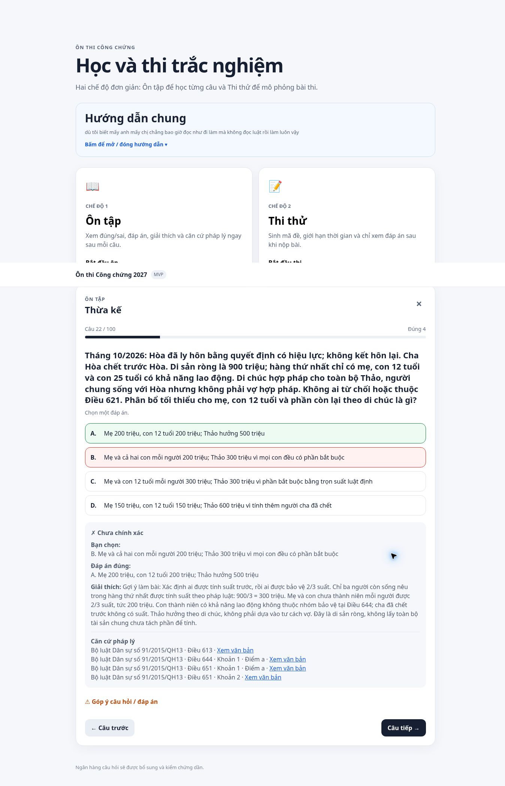

# Kiểm chứng tích hợp chuyên đề thừa kế

- Commit dữ liệu/web: `8a986158e6c47c8774bde4e95c6ced89ebc14e85`.
- GitHub Pages workflow `37483145724`: completed / success.
- URL đã mở và kiểm tra: https://hunghvt-cyber.github.io/CongchungVND/
- Trước triển khai, giao diện hiển thị 368 câu khả dụng; sau triển khai hiển thị 400 và 42 câu không đủ điều kiện vẫn giữ ngoài luyện/thi.
- Ôn tập Bài 2, 100 câu ngẫu nhiên: câu INH26-002 xuất hiện ở vị trí 22. Chọn sai phương án mọi con đều có phần bắt buộc; web khóa đáp án, hiện phản hồi sai, đáp án đúng mẹ 200 triệu/con 12 tuổi 200 triệu/Thảo 500 triệu, gợi ý cách giải và căn cứ Điều 613, Điều 644 khoản 1 điểm a, Điều 651 khoản 1 điểm a và khoản 2 BLDS.
- Thi thử Bài 2, 20 câu: tạo mã đề thành công, đồng hồ 15:00 giảm xuống 14:54; chọn một câu rồi sang câu 2, số đã làm tăng 0 → 1; không hiện lời giải trong lúc thi.
- Thoát trước khi nộp; không gửi bài thi kiểm tra giả vào kho kết quả chung. Chấm toàn bộ 32 câu chuyên đề được kiểm tra trong môi trường test, không cần tạo kết quả thật.
- Console kiểm tra: không có lỗi/cảnh báo ứng dụng trong log thu được. Có log lỗi của extension trình duyệt, không phải từ ứng dụng.
- `node --test tests/*.test.cjs`: 37 pass, 0 fail. Worktree được đối chiếu với cây commit từ API; không đổi các khóa/cấu trúc lưu tiến trình hoặc lịch sử.
- Mã đề chia sẻ ràng buộc phiên bản ngân hàng: mã tạo với ngân hàng cũ có thể cần tạo lại theo cơ chế kiểm tra phiên bản sẵn có; lịch sử bài đã nộp lưu snapshot được giữ nguyên. Đây không phải thay đổi schema lịch sử.

32 câu mới gồm 28 câu Thừa kế và 4 câu Quy trình, thủ tục và nghiệp vụ công chứng; 6 hiểu luật, 10 vận dụng, 16 vận dụng cao (nhãn biên tập). Tổng lưu trữ 942, active 400, review 36, archived 506. Không xóa hoặc đổi đáp án câu cũ trong đợt này. Tài liệu gốc không được công bố.

400 active không có nghĩa đã đạt toàn bộ ma trận hoặc chứng nhận toàn bộ bài giải gốc. 23 yêu cầu nguồn được sử dụng một phần, 22 yêu cầu còn review; nhánh chưa xác minh trong mục được sử dụng cũng chưa được chứng nhận. Xem `inheritance-source-review.json`, `inheritance-legal-evidence-2026.json`, `bank-audit-inheritance-after.json` và đề/bài giải để biết phạm vi cụ thể.
