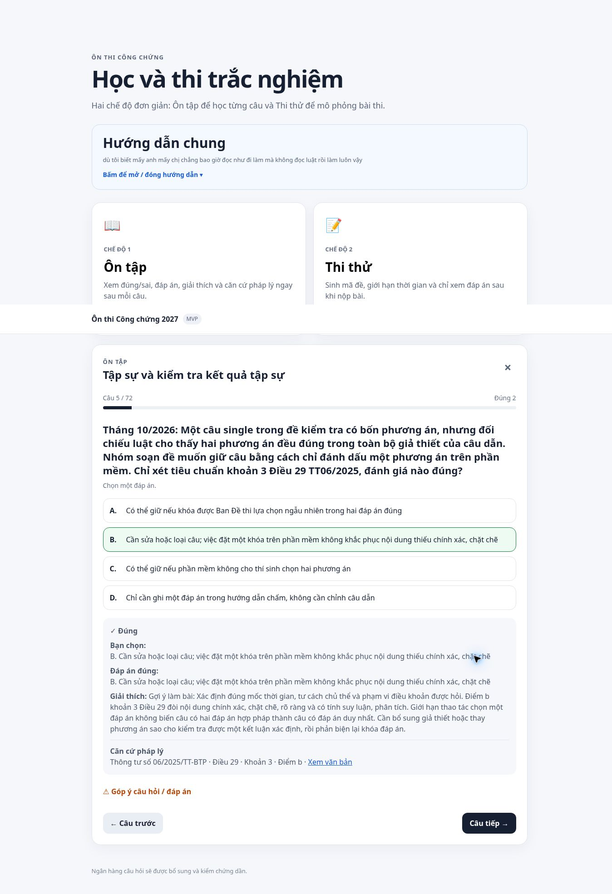

# Kiểm chứng bản rà soát 36 câu review — 06/10/2026

Commit dữ liệu: `dd0b5028005c0ae78871b6ead1d290424fa956bd`.

GitHub Pages workflow `37492001029`: **completed / success**. Đã mở trực tiếp https://hunghvt-cyber.github.io/CongchungVND/ sau khi triển khai.

- Màn hình Ôn tập hiển thị **426 câu được phép luyện/thi**, 16 bản ghi không đủ điều kiện trong 8 file được tải. Cả 16 bản ghi này là archived, không phải 16 review mới; 500 EXP archived không nằm trong loader.
- Bài 1 chọn 100 nhưng lấy đúng 72 câu hiện có. Qua 4 câu, đã thấy SRC26-003 mới viết lại. Chọn phương án B sau xáo trộn: điểm tăng từ 1 lên 2, lựa chọn bị khóa, hiện đúng đáp án, giải thích và Thông tư 06/2025 Điều 29 khoản 3 điểm b cùng link văn bản.
- Thi thử Bài 2 tạo đủ 20 câu, sinh mã CC1, đồng hồ từ 15:00 xuống 14:53; chọn một đáp án làm số đã làm tăng từ 0 lên 1, không hiện lời giải trong bài thi.
- Thoát bài thi kiểm thử trước khi nộp để không tạo kết quả giả trong thống kê. Chấm đầy đủ và lưu lịch sử được kiểm tra bằng bộ test.
- Log ứng dụng không có error/warn; bỏ các thông báo do chrome-extension tạo ra khỏi phạm vi ứng dụng.
- `node --test tests/*.test.cjs`: **39/39 đạt**. `node --check app.js` và kiểm tra diff/JSON đạt. Không sửa app.js, schema dữ liệu kết quả hoặc khóa localStorage.

Ảnh chụp nguyên trạng câu SRC26-003 trên web:

Phạm vi pháp lý và tồn đọng nguồn xem [báo cáo rà soát](pending-review-2026-10-06.md). Không dùng việc hết review trong data để tuyên bố hoàn tất các nhánh DOCX hoặc cân bằng ma trận.
